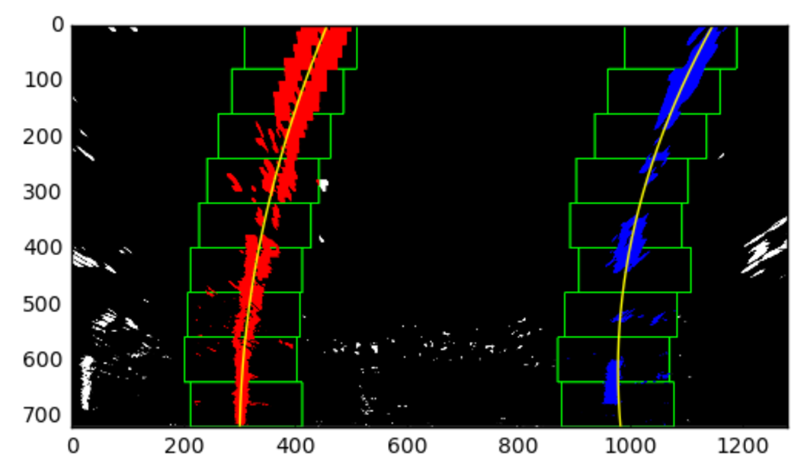

# Advanced Lane Finding

## Overview

In this project, I apply concepts of computer vision in order to detect the lane lines of a road. With this we are able to find the region that is the lane. In addition to this, I also extract information such as lane curvature and car offset. This information is presented by annotating the original image. This builds on my previous projects by using various techniques to better identify lane lines.

## Pipeline
- Undistort image
- Gaussian blur
- Various threshold selections
    - HLS color space selection
    - RGB color space selection
    - Directional edge detection with Sobel
- Convert image to grayscale
- Apply a perspective transform to get a bird's eye view
- Extract information of lane lines
- Annotate image with information obtained

We will follow this image of a road through the process of the pipeline

### Camera Calibration
Images from cameras are often distorted making an object's shape and size appear differently than in reality.
For example this image of a chessboard is distorted, making the center bulge.

To correct for this distortion, we identify the corners of the chessboard and map it to their correct relative positions.

Using this, we generate this function to take a set of images and create a set of distortion matrices, which will be used to undistort images.

    def calibrate_camera(images):
    """Returns camera calibration metrics
    Arguments:
    images: A set of images using checkerboard calibration
    """
    objp = np.zeros((6*9,3), np.float32)
    objp[:,:2] = np.mgrid[0:9,0:6].T.reshape(-1,2)
    
    # True location in grid
    objpoints = []
    # Location of corners in checkerboard
    imgpoints = []
    
    for image in images:
        gray = grayscale(image)
        ret, corners = cv2.findChessboardCorners(gray, (9,6), None)
        # If checkboard is detected
        if ret:
            objpoints.append(objp)
            imgpoints.append(corners)
            
    ret, mtx, dist, rvecs, tvecs = cv2.calibrateCamera(objpoints, imgpoints, gray.shape[::-1], None, None)
    
    return ret, mtx, dist, rvecs, tvecs
    
To undistort an image we use:
    image = cv2.undistort(calibration_image, mtx, dist, None, mtx)
    
In the end we get an image which is undistorted (with corners drawn highlighted corners)

### Gausssian Blur
We apply a slight blur to the image in order to smoothen out lines.

### Threshold and Grayscale
Our goal here is to highlight only the lane lines of the road. This can be accomplished by isolating colors or detecting edges of the image.

HLS Threshold to extract yellow and white parts of the lane
This color space is less sensitive to shadows than RGB which allows us to extract yellow more effectively
    
    def hls_select(img, h=(0,180), l=(0,255), s=(0,255)):
    """Selects parts of images within thresholds in HLS color space
    Arguments:
    img: An RGB image
    h: (int, int) in range 0-180
    l: (int, int) in range 0-255
    s: (int, int) in range 0-255
    Returns scaled mask multiplier
    """
    hls = cv2.cvtColor(img, cv2.COLOR_RGB2HLS)
    thresholds = np.array([h, l, s], dtype=np.uint8).T
    binary_output = cv2.inRange(hls, thresholds[0], thresholds[1])
    return binary_output

RGB Threshold to extract white parts of the lane
    
    def color_select(img, r=(0,255), g=(0,255), b=(0,255)):
    """Selects parts of images with thresholds in RGB color space
    Arguments:
    img: An RGB image
    r, g, b: (int, int) in range 0-255
    Returns scaled mask multiplier
    """
    thresholds = np.array([r, g, b], dtype=np.uint8).T
    binary_output = cv2.inRange(img, thresholds[0], thresholds[1])
    return binary_output

Combine this together additively

Apply a sobel edge detector to extract vertical lines
    
    def sobelx_select(img, sobel_kernel=3, thresh=(0, 255)):
    """Detects edges of an image using sobel horizontally
    Arguments:
    img: An RGB image
    sobel_kernel: Size of kernel (odd int >1)
    thresh: (int, int) in range 0-255
    Returns scaled mask multiplier
    """
    # Convert to grayscale
    gray = cv2.cvtColor(img, cv2.COLOR_RGB2GRAY)
    # Take sobel with respect to x
    sobelx = cv2.Sobel(gray, cv2.CV_64F, 1, 0, ksize=sobel_kernel)
    abs_sobelx = np.absolute(sobelx)
    # Scale the sobel appropriately
    scaled_sobelx = np.uint8(255*abs_sobelx/np.max(abs_sobelx))

    binary_output = cv2.inRange(scaled_sobelx, thresh[0], thresh[1])
    return binary_output
    

In combination I was able to extract the line lines of an image somewhat effectively.

###  Perspective Transformation
To get a better view of the lane lines we apply a perspective transform to get a bird's eye view of the road.
In addition to this, we are able to fit a polynomial regression line. With this, we can extract information such as the lane's curvature. In this perspective straight lines are parallel rather than vanishing. Later this will be inversely transformed to the original image.

    def get_perspective_matrices():
        """Generates persepctive matrix for bird's eye view
        Assumes constants for transform
        """
        img_size = (1280, 720)
        # Offset of left/right sides
        offset = 300
        # Pixels of the image assumed to represent a straight line
        # Top-Left, Top-Right, Bottom-Left, Bottom-Right
        src = np.float32([[572,469],[713,469],[278,677],[1031,677]])
        dst = np.float32([[offset, offset], [img_size[0]-offset, offset],
                                        [offset, img_size[1]],
                                         [img_size[0]-offset, img_size[1]]])
        M = cv2.getPerspectiveTransform(src, dst)
        Minv = cv2.getPerspectiveTransform(dst, src)
        return M, Minv

    def birds_eye_view(img, M):
        "Returns a bird's eye perspective of the image"
        img_size = (img.shape[1], img.shape[0])
        warped = cv2.warpPerspective(img, M, img_size, flags=cv2.INTER_LINEAR)
        return warped
        

### Extract Information
The perspective transform allows us to extract certain information that we would not be able to before. With the perspective transform, parallel lines do not converge to a vanishing point. We are able to fit a regression line which reflect the curvature of the lane.

#### Fitting a regression line to the lane
First we must identify the pixels which correspond to the line line.
To isolate each lane line, I used a sliding window technique to identity lane pixels
A histogram is formed to identify the concentration of vertical pixels. A window is assigned to two peaks on both sides of the car. The lane line will shift only a certain amount on either side. This is continued until the top of the image.

Currently, this is repeated every image. However, after we identify the lane in one image we can extrapolate the location of the lane pixels in the next image. This technique also fails on sharp turns, since the windows assume a certain margin. A wider margin would capture this sharp turn. Also, the windows do not extend past the image and will get stuck on either side of the image.

With these points, I fit a second degree polynomial to the lane.

    def fit_polynomial(binary_warped):
        """Returns polynomials of lane lines detected in image"""
        # Find lane pixels
        leftx, lefty, rightx, righty, ploty, out_img = find_lane_pixels(binary_warped)

        # Find a second order line
        left_fit = np.polyfit(lefty, leftx, 2)
        right_fit = np.polyfit(righty, rightx, 2)

        out_img[lefty, leftx] = [255, 0, 0]
        out_img[righty, rightx] = [0, 0, 255]

        left_fitx = left_fit[0]*ploty**2 + left_fit[1]*ploty + left_fit[2]
        right_fitx = right_fit[0]*ploty**2 + right_fit[1]*ploty + right_fit[2]

        #Only works for single images
        plt.plot(left_fitx, ploty, color='yellow')
        plt.plot(right_fitx, ploty, color='yellow')

        return left_fit, right_fit, ploty, out_img

#### Calculating the curvature of the lane

We are also able to figure out the curvature of a line through the second degree polynomial

R curve = (1+(2Ay + B)^2)^1.5)/|2A|

    def radius_of_curvature(self):
        """Returns radius of curvature in meters"""
        A, B, C = self.best_fit
        A *= self.mx/(self.my**2)
        B *= self.mx/self.my
        y_eval = np.max(self.ploty) * self.my
        radius = ((1 + (2*A*y_eval + B)**2)**1.5) / np.absolute(2*A)
        return radius

### Annotate Image

Finally we annotate the image with information we have gathered.

## Shortcomings and Difficulties
With these improvements, there are still situations in which the detector will fail.
Currently, the dectector only performs well under ideal near ideal conditions. Harsh lighting will cause the detector to fail. Although HSL is more robust against changing light conditions. Whitewashed images such as those found in the harder challenge video proves to be very difficult. Shadows such as those under a bridge will cause the detector to lose track of the lane lines. There are two paths of improvement for the near future.
The first improvement would be trying to build a more robust system to detect lane lines in harsh lighting conditions. One way of accomplishing this whould be using different color spaces, such as HSV or LAB.
The main problem with this approach is that it will only work under certain conditions. The threshold values must be set exactly right for various road conditions and may not generalize correctly. Finding the correct values for ideal lane lines was difficult enough.

Since the primary input of the pipeline is video, we can leverage multiple frames to improve our lines. Currently, the lane lines are fitted to the average of n previous frames. Keeping track of old lane lines we can predict future lane lines. Also, we can compare the two lane lines against each other to check if they are reasonable, such if the lane's width are consistent.

Output videos are saved in the output_images directory.